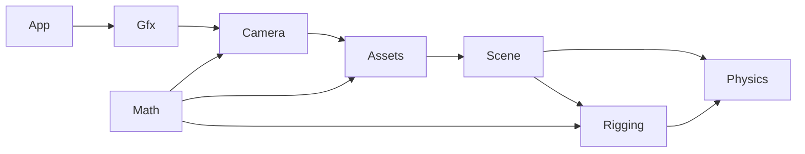
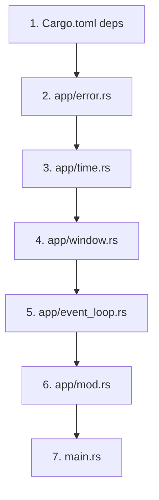
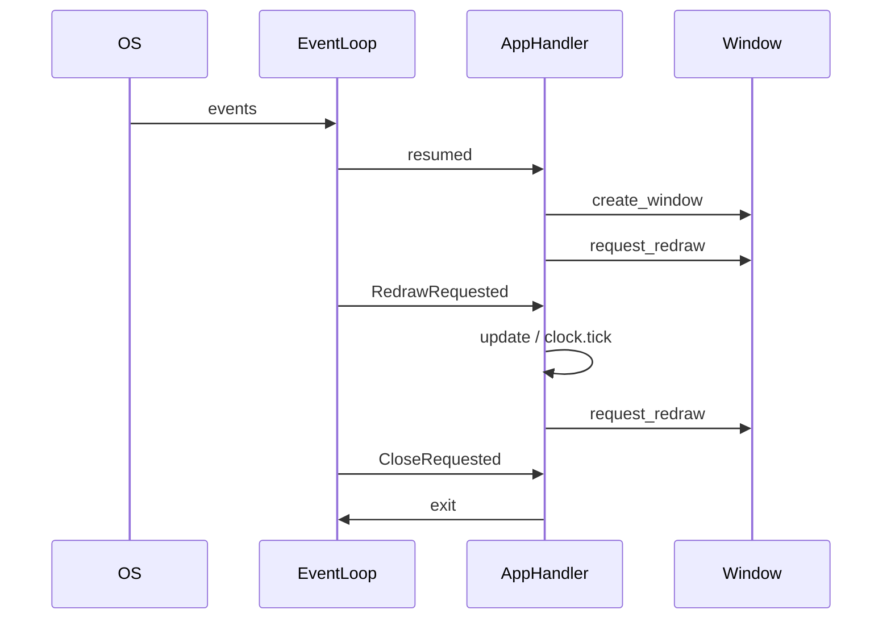
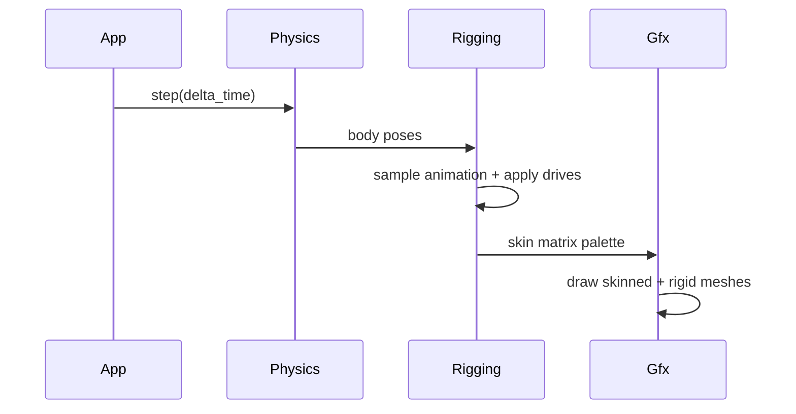

# GAVAR Engine Framework Plan

Starting point: empty Rust crate ([`src/main.rs`](z:/GAVAR/gavar_engine/src/main.rs), no dependencies in [`Cargo.toml`](z:/GAVAR/gavar_engine/Cargo.toml)).

**Stack (locked in from your choices):**
- Window/events: **winit**
- Rendering: **wgpu**
- Math: **glam**
- Models: **gltf** (+ **gltf-json** if you want lower-level control)
- Physics: **rapier3d**
- Logging (optional but useful early): **env_logger** + **log**

**Target module tree** (you add folders as you reach each phase):

```text
src/
  main.rs                 # thin entry: init logger, run App
  app/                    # Phase 1
  gfx/                    # Phase 2–3
  math/                   # Phase 4 (shared; used by camera + later phases)
  camera/                 # Phase 4
  assets/                 # Phase 5
  scene/                  # Phase 3–6 (ties rendering + loaded data together)
  physics/                # Phase 6
  rigging/                # Phase 6
```

Dependency flow:



---

## Phase 1 — Open a window (detailed)

**Goal:** A resizable window, event loop, clean shutdown. No GPU yet.

**winit version note:** Use **winit 0.30+**, which uses the `ApplicationHandler` trait instead of the old closure-based `event_loop.run()`. This is the current best practice and matches what wgpu examples use in Phase 2.

### Why separate files (best practice)

`main.rs` should be a **3–5 line entry point**. Everything about windows and the loop lives under `src/app/` because:

1. **Single responsibility** — `window.rs` only *creates* a window; `event_loop.rs` only *reacts* to events; neither belongs in `main.rs`.
2. **Phase 2 hook point** — wgpu will need `window` + `event_loop` references inside the handler; a dedicated `App` struct in `app/mod.rs` is where those get wired together later.
3. **Testability** — `WindowConfig` (title, size) can be changed without touching bootstrap code.
4. **Readable crate root** — `main.rs` reads as: start logging → run app → propagate errors.

**What goes where (hard rule):**

| Location | Allowed | Not allowed |
|----------|---------|-------------|
| [`main.rs`](z:/GAVAR/gavar_engine/src/main.rs) | `mod app;`, logger init, `App::new()?.run()` | winit imports, event matching, window attributes |
| [`app/window.rs`](z:/GAVAR/gavar_engine/src/app/window.rs) | `WindowAttributes`, `WindowConfig`, `create_window()` | Event loop, frame updates, input handling |
| [`app/event_loop.rs`](z:/GAVAR/gavar_engine/src/app/event_loop.rs) | `ApplicationHandler` impl, all `WindowEvent` arms | Window attribute defaults (pull from `WindowConfig`) |
| [`app/time.rs`](z:/GAVAR/gavar_engine/src/app/time.rs) | `Clock`, `delta_time`, `fps` | Any winit types |
| [`app/mod.rs`](z:/GAVAR/gavar_engine/src/app/mod.rs) | `App` struct, `new()`, `run()`, module wiring | Long event match blocks (delegate to handler) |
| [`app/error.rs`](z:/GAVAR/gavar_engine/src/app/error.rs) (optional) | `AppError` enum | — |

### Target file tree (Phase 1 only)

```text
src/
  main.rs
  app/
    mod.rs          # App struct + run()
    error.rs        # AppError (optional but recommended)
    window.rs       # WindowConfig + create_window()
    event_loop.rs   # AppHandler: ApplicationHandler
    time.rs         # Clock
```

### Module dependency order (create files in this sequence)



---

### Step-by-step implementation order

Work through these in order. Run `cargo build` after steps 6, 12, 18, and 25; run `cargo run` after step 25.

#### A — Project setup (steps 1–3)

**Step 1 — Add dependencies**

Edit [`Cargo.toml`](z:/GAVAR/gavar_engine/Cargo.toml):

```toml
[dependencies]
winit = "0.30"
log = "0.4"
env_logger = "0.11"
```

**Step 2 — Declare the app module (empty shell)**

In [`main.rs`](z:/GAVAR/gavar_engine/src/main.rs), replace hello-world with only:

```rust
mod app;
```

Create [`src/app/mod.rs`](z:/GAVAR/gavar_engine/src/app/mod.rs) as an empty module placeholder (e.g. `// Phase 1 modules added below`).

**Step 3 — Verify compile**

Run `cargo build`. Should succeed with an empty `app` module and no `main` body yet — add temporarily `fn main() {}` if needed, remove once `App::run` exists.

---

#### B — Error type (steps 4–5)

**Step 4 — Create `app/error.rs`**

Define a small error enum so `main` stays clean:

```rust
pub enum AppError {
    Winit(winit::error::OsError),
    EventLoop(winit::error::EventLoopError),
}
```

Implement `From` for winit error types and `std::error::Error` + `Display` (or use `thiserror` later if you prefer).

**Step 5 — Export from `mod.rs`**

In `app/mod.rs`: `mod error;` and `pub use error::AppError;`

---

#### C — Frame clock (steps 6–8)

**Step 6 — Create `app/time.rs`**

Add a `Clock` struct:

- Field: `last_instant: Instant` (from `std::time`)
- Method: `tick() -> f32` — returns `delta_time` in seconds, updates `last_instant`
- Optional: `fps()` for debug logging

No winit imports in this file.

**Step 7 — Wire `time` module**

In `app/mod.rs`: `mod time;`

**Step 8 — Build check**

`cargo build` — confirms module tree compiles.

---

#### D — Window creation (steps 9–13)

**Step 9 — Create `app/window.rs`**

Define **`WindowConfig`** (your settings, not winit's):

```rust
pub struct WindowConfig {
    pub title: &'static str,
    pub width: u32,
    pub height: u32,
}
```

Add `impl Default for WindowConfig` with GAVAR defaults (e.g. title `"GAVAR"`, 1280×720).

**Step 10 — Add `create_window` function**

Signature (winit 0.30 pattern):

```rust
pub fn create_window(
    event_loop: &ActiveEventLoop,
    config: &WindowConfig,
) -> Result<Window, AppError>
```

Inside:

1. Build `Window::default_attributes()`
2. Chain `.with_title(config.title)`
3. Chain `.with_inner_size(LogicalSize::new(config.width, config.height))`
4. Call `event_loop.create_window(attrs)?`

**Step 11 — Keep window.rs free of events**

Do **not** handle `CloseRequested`, resize, or redraw here. This file only builds the OS window handle.

**Step 12 — Wire `window` module**

In `app/mod.rs`: `mod window;` + `pub use window::WindowConfig;`

**Step 13 — Build check**

`cargo build`

---

#### E — Event loop handler (steps 14–20)

**Step 14 — Create `app/event_loop.rs`**

Define **`AppHandler`** struct — this is the state winit drives each frame:

```rust
pub struct AppHandler {
    window: Option<Window>,       // None until resumed()
    clock: Clock,
    config: WindowConfig,
    // Phase 2: renderer goes here
}
```

**Step 15 — Implement `ApplicationHandler for AppHandler`**

Import: `winit::application::ApplicationHandler`

Implement these methods **in this order** (mirrors winit lifecycle):

1. **`resumed`** — called when app becomes active; create window if `self.window.is_none()`:
   - `self.window = Some(create_window(event_loop, &self.config)?);`
   - `window.request_redraw();` — kicks off first frame
2. **`window_event`** — match on `(window_id, event)`:
   - `WindowEvent::CloseRequested` → `event_loop.exit();`
   - `WindowEvent::Resized(size)` → log or store size (Phase 2: recreate swapchain)
   - `WindowEvent::RedrawRequested` → call `self.update()` then `window.request_redraw()` for continuous loop
   - `_` → `{}` (ignore rest for now)
3. **`about_to_wait`** — optional: `window.request_redraw()` for idle-driven loop (alternative to chaining redraw inside `RedrawRequested`)
4. **`suspended`** — optional: drop window on mobile; on desktop usually empty

**Step 16 — Add `update()` method on `AppHandler`**

Private method called from `RedrawRequested`:

```rust
fn update(&mut self) {
    let dt = self.clock.tick();
    log::debug!("frame dt = {dt:.4}s");
}
```

**Step 17 — Stub input handlers (optional, recommended)**

In `window_event`, add no-op arms for:

- `KeyboardInput` / `MouseInput` / `CursorMoved` — empty blocks, ready for Phase 4 camera

This avoids restructuring `event_loop.rs` later.

**Step 18 — Wire `event_loop` module**

In `app/mod.rs`: `mod event_loop;` (keep `AppHandler` private — `pub(crate)` at most).

**Step 19 — Build check**

`cargo build` — fix any winit API mismatches (use `ActiveEventLoop`, not deprecated types).

**Step 20 — Understand the loop (read before continuing)**

The runtime flow you just built:



---

#### F — App orchestration (steps 21–23)

**Step 21 — Flesh out `App` in `app/mod.rs`**

```rust
pub struct App {
    config: WindowConfig,
}

impl App {
    pub fn new() -> Self { ... }

    pub fn run(self) -> Result<(), AppError> {
        env_logger::init(); // or keep in main — either is fine
        let event_loop = EventLoop::builder().build()?;
        let mut handler = AppHandler::new(self.config);
        event_loop.run_app(&mut handler)?;
        Ok(())
    }
}
```

**Step 22 — Add `AppHandler::new(config)` constructor**

In `event_loop.rs`, initialize `clock`, `config`, `window: None`.

**Step 23 — Build check**

`cargo build`

---

#### G — Thin entry point (steps 24–25)

**Step 24 — Finalize `main.rs`**

Target contents (approximately):

```rust
mod app;

fn main() -> Result<(), app::AppError> {
    app::App::new().run()
}
```

If you init the logger here instead of inside `App::run`:

```rust
fn main() -> Result<(), app::AppError> {
    env_logger::init();
    app::App::new().run()
}
```

Pick **one** place for `env_logger::init()` — not both.

**Step 25 — Run and verify**

`cargo run` and confirm:

- [ ] Window opens with title "GAVAR" (or your chosen title)
- [ ] Window is resizable; dragging edges does not crash
- [ ] Closing the window exits the process with code 0
- [ ] Debug logs show `frame dt = ...` each frame (run with `RUST_LOG=debug cargo run`)

---

#### H — Polish and Phase 2 prep (steps 26–28)

**Step 26 — Store window size on resize**

In `AppHandler`, add field `size: PhysicalSize<u32>`. Update it in `WindowEvent::Resized`. Phase 2 wgpu reads this to configure the surface.

**Step 27 — Add `window()` accessor**

On `AppHandler`: `fn window(&self) -> Option<&Window>` — Phase 2 renderer will need the raw window reference for `wgpu::Surface`.

**Step 28 — Document the redraw contract**

Add a one-line comment in `event_loop.rs`: *"RedrawRequested → update → request_redraw; render call goes in update() starting Phase 2."*

---

### Phase 1 — Done when

- Window opens, resizes, closes cleanly.
- Console shows frame deltas each frame.
- `main.rs` is ≤10 lines with zero winit event logic.
- `window.rs` has no event handling; `event_loop.rs` has no window attribute defaults hard-coded (uses `WindowConfig`).

### Common mistakes to avoid

1. **Putting `event_loop.run()` inline in `main`** — works for tutorials, breaks once you add wgpu state to the handler.
2. **Creating the window before `resumed`** — on winit 0.30, create the window inside `ApplicationHandler::resumed`, not before `run_app`.
3. **Forgetting `request_redraw()`** — without it, you get one frame or a frozen window.
4. **Mixing `ControlFlow::Poll` old API** — winit 0.30 `run_app` manages this; don't port old winit 0.28 tutorials verbatim.
5. **Making every module `pub`** — use `pub(crate)` for `AppHandler`, `create_window`; only expose `App` and `AppError` to `main`.

---

## Phase 2 — Render triangles in the window

**Goal:** One colored triangle on a clear-color background via wgpu.

### Sub-topics
1. **GPU context** — pick adapter, create `Device` + `Queue`.
2. **Surface / swapchain** — bind window to wgpu surface; recreate on resize.
3. **Shader module** — WGSL vertex + fragment shaders (position + color in, color out).
4. **Render pipeline** — vertex layout, pipeline layout, depth-less pass for now.
5. **GPU buffers** — upload 3 vertices (position + color) to a `VertexBuffer`.
6. **Render pass** — clear, set pipeline, draw 3 vertices, present.
7. **Integrate with app loop** — call `renderer.render()` every frame after events.

### Files to create
| File | Responsibility |
|------|----------------|
| [`src/gfx/mod.rs`](z:/GAVAR/gavar_engine/src/gfx/mod.rs) | Public gfx API |
| [`src/gfx/context.rs`](z:/GAVAR/gavar_engine/src/gfx/context.rs) | wgpu instance, adapter, device, queue |
| [`src/gfx/surface.rs`](z:/GAVAR/gavar_engine/src/gfx/surface.rs) | Surface config, resize, acquire/present |
| [`src/gfx/shader.rs`](z:/GAVAR/gavar_engine/src/gfx/shader.rs) | Load/compile WGSL |
| [`src/gfx/vertex.rs`](z:/GAVAR/gavar_engine/src/gfx/vertex.rs) | `Vertex` struct + `VertexBufferLayout` |
| [`src/gfx/pipeline.rs`](z:/GAVAR/gavar_engine/src/gfx/pipeline.rs) | Pipeline builder |
| [`src/gfx/mesh.rs`](z:/GAVAR/gavar_engine/src/gfx/mesh.rs) | CPU-side mesh + GPU buffer upload |
| [`src/gfx/renderer.rs`](z:/GAVAR/gavar_engine/src/gfx/renderer.rs) | Owns pipeline + draws one mesh |
| [`assets/shaders/basic.wgsl`](z:/GAVAR/gavar_engine/assets/shaders/basic.wgsl) | WGSL source (keep out of `src/`) |

### Cargo.toml additions
```toml
wgpu = "24"
pollster = "0.4"   # block_on for async wgpu init
bytemuck = { version = "1", features = ["derive"] }
```

### Done when
- One triangle visible, background clears each frame, resize does not crash.

---

## Phase 3 — Render more triangles

**Goal:** Multiple independent meshes (different vertex data, transforms, colors) drawn in one frame.

### Sub-topics
1. **Mesh handle / ID** — store many meshes without duplicating pipeline code.
2. **Mesh registry** — `MeshLibrary`: insert, lookup, optional remove.
3. **Draw list** — `DrawCommand { mesh_id, transform, ... }` collected each frame.
4. **Uniform / push constants** — per-object model matrix (even a stub `Mat4` before camera exists).
5. **Depth buffer** — enable depth test so overlapping triangles sort correctly.
6. **Index buffers** — support indexed quads/cubes (2 tris each) not just 3-vertex strips.
7. **Scene bridge (minimal)** — `Scene` holds meshes + draw list; renderer consumes it.

### Files to create / extend
| File | Responsibility |
|------|----------------|
| [`src/gfx/mesh.rs`](z:/GAVAR/gavar_engine/src/gfx/mesh.rs) | Extend: indexed geometry, multiple uploads |
| [`src/gfx/draw.rs`](z:/GAVAR/gavar_engine/src/gfx/draw.rs) | `DrawCommand`, batching loop |
| [`src/gfx/uniforms.rs`](z:/GAVAR/gavar_engine/src/gfx/uniforms.rs) | Bind group for model MVP stub |
| [`src/scene/mod.rs`](z:/GAVAR/gavar_engine/src/scene/mod.rs) | Scene root |
| [`src/scene/mesh_instance.rs`](z:/GAVAR/gavar_engine/src/scene/mesh_instance.rs) | Instance = mesh ref + transform |
| [`assets/shaders/basic.wgsl`](z:/GAVAR/gavar_engine/assets/shaders/basic.wgsl) | Add `model` uniform + depth |

### Done when
- 2+ meshes (e.g. triangle + cube) render at different positions without copy-pasting renderer code.

---

## Phase 4 — Camera that moves in 3D

**Goal:** Perspective camera with WASD + mouse look (or similar); all meshes view correctly.

### Sub-topics
1. **Math primitives** — `Transform`, helpers wrapping **glam** (`Vec3`, `Mat4`, `Quat`).
2. **Camera struct** — view matrix, perspective projection, aspect from window size.
3. **Camera controller** — map input events → position/yaw/pitch; clamp pitch.
4. **Uniform layout** — single `CameraUniform { view, proj }` bind group shared by all draws.
5. **Wire into shaders** — vertex shader: `clip = proj * view * model * local_pos`.
6. **Resize handling** — update aspect ratio on window resize.
7. **Optional debug** — log camera position; later useful for physics debugging.

### Files to create
| File | Responsibility |
|------|----------------|
| [`src/math/mod.rs`](z:/GAVAR/gavar_engine/src/math/mod.rs) | Re-exports + small helpers |
| [`src/math/transform.rs`](z:/GAVAR/gavar_engine/src/math/transform.rs) | Translation/rotation/scale → `Mat4` |
| [`src/camera/mod.rs`](z:/GAVAR/gavar_engine/src/camera/mod.rs) | Module root |
| [`src/camera/camera.rs`](z:/GAVAR/gavar_engine/src/camera/camera.rs) | View/proj math |
| [`src/camera/controller.rs`](z:/GAVAR/gavar_engine/src/camera/controller.rs) | Input → camera motion |
| [`src/gfx/uniforms.rs`](z:/GAVAR/gavar_engine/src/gfx/uniforms.rs) | Extend with camera bind group |
| [`src/app/event_loop.rs`](z:/GAVAR/gavar_engine/src/app/event_loop.rs) | Forward input to controller |

### Cargo.toml additions
```toml
glam = { version = "0.29", features = ["bytemuck"] }
```

### Done when
- Fly around multiple meshes; near/far clip and aspect feel correct on resize.

---

## Phase 5 — Load a full 3D triangle model (glTF)

**Goal:** Load a `.gltf` / `.glb` file with meshes (triangles), materials (basic), and skeleton data preserved for Phase 6.

### Sub-topics
1. **Asset path / I/O** — resolve paths relative to project or an `assets/` root.
2. **glTF parse** — walk scenes → nodes → meshes → primitives.
3. **Vertex extraction** — positions, normals, UVs (UV optional initially), indices.
4. **GPU upload path** — convert parsed data → existing `Mesh` + `MeshLibrary` entries.
5. **Node hierarchy** — store local transforms; compute world transforms for static pose.
6. **Material stub** — single default material or flat color per primitive.
7. **Skeleton capture (no animation yet)** — joints, inverse bind matrices, skin weights per vertex.
8. **Scene spawn** — `ModelInstance` added to `Scene` from loaded asset handle.
9. **Test asset** — one simple rigged glTF (e.g. from Khronos samples or Blender export).

### Files to create
| File | Responsibility |
|------|----------------|
| [`src/assets/mod.rs`](z:/GAVAR/gavar_engine/src/assets/mod.rs) | Asset manager entry |
| [`src/assets/path.rs`](z:/GAVAR/gavar_engine/src/assets/path.rs) | Path resolution |
| [`src/assets/model.rs`](z:/GAVAR/gavar_engine/src/assets/model.rs) | `Model`, `MeshData`, `Material` |
| [`src/assets/gltf_loader.rs`](z:/GAVAR/gavar_engine/src/assets/gltf_loader.rs) | glTF → `Model` |
| [`src/scene/model_instance.rs`](z:/GAVAR/gavar_engine/src/scene/model_instance.rs) | Loaded model in scene |
| [`src/rigging/skeleton.rs`](z:/GAVAR/gavar_engine/src/rigging/skeleton.rs) | **Read-only stub**: joint tree from glTF (used in Phase 6) |

### Cargo.toml additions
```toml
gltf = "1"
```

### Done when
- A glTF character/prop renders in the scene with correct static pose; skeleton + skin weights are stored in memory.

---

## Phase 6 — Physics simulation on a rigged model

**Goal:** Rapier world drives rigid parts of the model; skeletal rig deforms skinned vertices; animation + physics can coexist.

Split into two cooperating tracks: **physics** and **rigging**, merged at the end.

### 6A — Physics (Rapier)

**Sub-topics**
1. **Physics world** — `PhysicsPipeline`, gravity, timestep synced to `delta_time`.
2. **Collider shapes** — tri mesh (static), cuboid/capsule (dynamic), convex hull (optional).
3. **Rigid bodies** — static ground + dynamic props; pose readback each frame.
4. **Scene sync** — `PhysicsBody` component maps Rapier handle ↔ scene transform.
5. **Debug draw (optional)** — wireframe colliders for tuning.

**Files**
| File | Responsibility |
|------|----------------|
| [`src/physics/mod.rs`](z:/GAVAR/gavar_engine/src/physics/mod.rs) | Module root |
| [`src/physics/world.rs`](z:/GAVAR/gavar_engine/src/physics/world.rs) | Rapier setup + step |
| [`src/physics/body.rs`](z:/GAVAR/gavar_engine/src/physics/body.rs) | Body/collider handles |
| [`src/physics/sync.rs`](z:/GAVAR/gavar_engine/src/physics/sync.rs) | Physics → scene transforms |
| [`src/scene/physics_body.rs`](z:/GAVAR/gavar_engine/src/scene/physics_body.rs) | Link entity to Rapier |

### 6B — Rigging (skinning + animation)

**Sub-topics**
1. **Skeleton runtime** — joint local transforms, world matrices, inverse bind.
2. **Skin weights** — up to 4 bones/vertex; joint index + weight arrays on GPU.
3. **Animation clips** — load glTF animations; sample keyframes → joint locals.
4. **Skinning pipeline** — WGSL skinning vertex shader OR CPU skinning first (CPU is easier to debug).
5. **Pose from physics** — map specific rigid bodies to joint indices (e.g. ragdoll: pelvis, limbs).
6. **Update order** — `physics.step` → update driven joints → `animation.sample` → compute skin matrices → render.

**Files**
| File | Responsibility |
|------|----------------|
| [`src/rigging/mod.rs`](z:/GAVAR/gavar_engine/src/rigging/mod.rs) | Module root |
| [`src/rigging/skeleton.rs`](z:/GAVAR/gavar_engine/src/rigging/skeleton.rs) | Extend: runtime pose |
| [`src/rigging/skin.rs`](z:/GAVAR/gavar_engine/src/rigging/skin.rs) | Skin weights + palette |
| [`src/rigging/animation.rs`](z:/GAVAR/gavar_engine/src/rigging/animation.rs) | Clip sampling |
| [`src/rigging/physics_drive.rs`](z:/GAVAR/gavar_engine/src/rigging/physics_drive.rs) | Ragdoll / constraint mapping |
| [`src/gfx/skinned_mesh.rs`](z:/GAVAR/gavar_engine/src/gfx/skinned_mesh.rs) | Skinned draw path |
| [`assets/shaders/skinned.wgsl`](z:/GAVAR/gavar_engine/assets/shaders/skinned.wgsl) | Bone matrix skinning |

### 6C — Integration

**Sub-topics**
1. **Ragdoll definition** — config: which joints follow physics vs animation.
2. **State machine** — animated ↔ ragdoll transition (even a manual key toggle is fine v1).
3. **Single update graph** — document fixed order in [`src/app/event_loop.rs`](z:/GAVAR/gavar_engine/src/app/event_loop.rs) or [`src/scene/systems.rs`](z:/GAVAR/gavar_engine/src/scene/systems.rs).



### Cargo.toml additions
```toml
rapier3d = "0.22"
```

### Done when
- Rigged glTF model falls/settles under gravity (ragdoll or partial physics drive) while mesh skinning stays intact.

---

## Cross-cutting: keep the framework flexible

Apply these conventions as you go (cheap now, saves refactors later):

1. **Thin `main.rs`** — only bootstraps modules; no game logic.
2. **Traits at boundaries** — e.g. `AssetLoader`, `MeshSource`, `PhysicsWorld` traits so implementations can be swapped.
3. **Handles not raw pointers** — `MeshId`, `ModelId`, `BodyId` instead of passing GPU/Rapier internals everywhere.
4. **One `Scene` truth** — rendering, loading, and physics all read/write through scene components.
5. **Systems file (when Phase 6 starts)** — [`src/scene/systems.rs`](z:/GAVAR/gavar_engine/src/scene/systems.rs) for ordered update steps instead of bloating `event_loop.rs`.

---

## Suggested implementation order inside each phase

Work top-to-bottom within each phase’s file list. After Phase 2, run `cargo run` after every file/module you add. Keep one “hello triangle” code path until Phase 3 replaces it with the mesh registry.

**First milestone demo path:** window → triangle → cube + triangle → fly camera → imported glTF → ragdoll drop.
